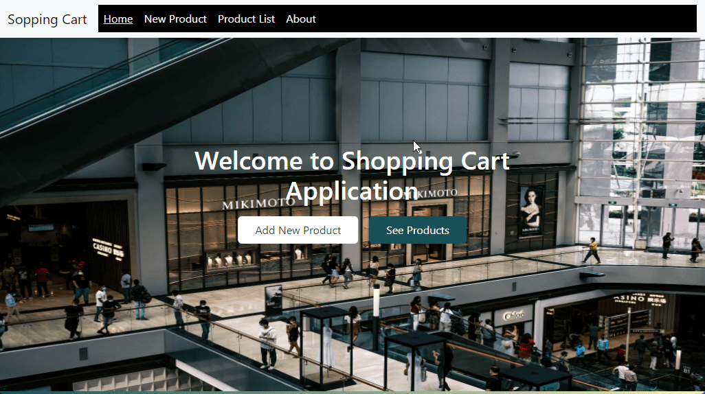

# Hi I'm Nurdoğan Bahadır 👋. Welcome to my Shopping Project with React.

In this project, I made a shopping application with the data we get from the API. We can add, edit and delete the data on the API if you want. We can also view the shopping details and view the cart amount on the card.

# Live Link of the Project

[Click Me](https://shopping-app-nurdoganbahadir.netlify.app)

# Libraries and Technologies I use

- useState
- useEffect
- axios
- react bootstrap
- async await
- API
- react router dom

#How to install

In the project directory, you can run:

### `npm start`

# How does my project look

